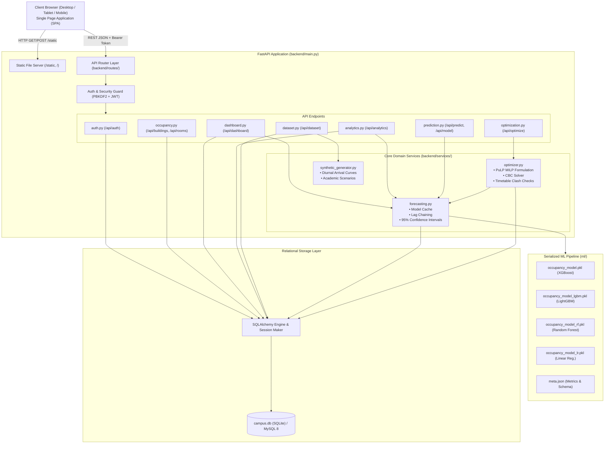
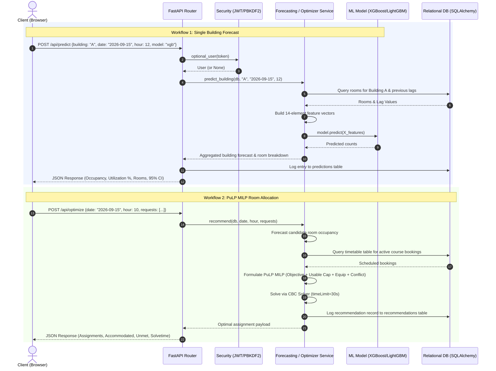
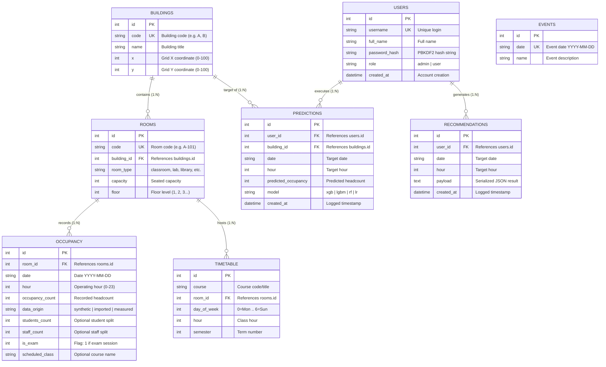

# System Architecture Document

**Project Name:** Smart Campus Occupancy Forecasting with Spatiotemporal Analytics & Capacity Optimization  
**Document Version:** 1.0.0  
**Architectural Style:** Modular Layered Client-Server (REST API + Asynchronous ASGI Engine + SPA)  
**Status:** Code-Verified / Implemented  

---

## 1. Architecture Overview

The **CampusPulse** platform is engineered as a high-performance, modular, layered client-server system. It decouples high-level analytical data presentation from server-side numerical computing, predictive modeling, and mathematical optimization. 

The architecture bridges three primary computational domains:
1. **Interactive Client Layer (Browser SPA):** A lightweight, zero-build Vanilla JavaScript single-page application integrating HTML5 Canvas and Plotly.js for interactive spatiotemporal charting.
2. **Asynchronous REST Service Layer (FastAPI ASGI Engine):** A high-throughput Python API service orchestrating request validation, role-based security, query resolution, and static asset serving.
3. **Domain & Computational Services Layer:** High-performance specialized analytical engines:
   - **Machine Learning Inference Service:** Loads trained gradient boosting decision trees (XGBoost, LightGBM, Random Forest) with memory caching for sub-80ms room-level inference and confidence interval calculation.
   - **Mathematical Optimization Service:** Formulates and solves Mixed-Integer Linear Programs (MILP) using PuLP and the COIN-OR CBC branch-and-cut solver.
   - **Data Ingestion & Synthesis Pipeline:** Processes incoming CSV/Excel datasets, sanitizes records, performs provenance tracking (`synthetic`, `imported`, `measured`), and simulates IoT streams.
   - **Persistence Layer (SQLAlchemy ORM):** Interacts with an ACID-compliant relational database (SQLite default; MySQL 8 ready).

---

## 2. Architecture Style & Principles

The codebase adheres to the following core architectural patterns:

- **Modular Layered Architecture:** Clear vertical separation of concerns: Presentation (SPA) $\rightarrow$ API Routing (`routes/`) $\rightarrow$ Business Logic & Algorithms (`services/`) $\rightarrow$ Data Access (`models.py`, `database.py`).
- **Stateless RESTful Design:** The API does not maintain server-side session state. Client requests are authenticated via self-contained, signed JSON Web Tokens (JWT) in HTTP `Authorization` headers.
- **Dependency Injection:** FastAPI's `Depends` system provides database sessions (`get_db`) and role-based authentication guards (`require_user`, `require_admin`).
- **Mathematical Feasibility Guarantee:** The optimization domain employs bounded slack dummy variables to prevent infeasibility faults.
- **Fail-Safe Lazy Loading:** Heavy machine learning libraries (such as TensorFlow for LSTM) are isolated from server startup to ensure rapid boot times and lightweight operational memory footprints.

---

## 3. Technology Stack

| Layer | Technology | Version | Purpose in Codebase |
| :--- | :--- | :--- | :--- |
| **Frontend UI** | HTML5 / Vanilla CSS3 | Standard | Layout, cards, badges, modal dialogs, and responsive grids (`frontend/static/css/app.css`) |
| **Client Controller** | Vanilla ECMAScript 6+ | ES2022 | Navigation routing, async API handling, CSV export, and DOM state (`frontend/static/js/app.js`) |
| **Visualization** | Plotly.js & HTML5 Canvas | v2.35.2 | Dynamic heatmaps, 13-hour forecast curves, 14-day tracking, and canvas utilization bars |
| **Web Server / ASGI** | Uvicorn (Standard) | $\ge 0.29.0$ | Asynchronous Server Gateway Interface hosting FastAPI application |
| **Backend Framework** | FastAPI | $\ge 0.110.0$ | Asynchronous REST routing, middleware, CORS, OpenAPI schema, and static file mounting |
| **Data Validation** | Pydantic v2 | $\ge 2.6.0$ | Request parsing, schema validation, and response serialization (`backend/schemas.py`) |
| **Security & Auth** | PyJWT & `hashlib` | $\ge 2.8.0$ | PBKDF2-HMAC-SHA256 password hashing (120,000 iters) and HS256 JWT tokens |
| **ORM / Data Access** | SQLAlchemy | $\ge 2.0.0$ | Connection pooling, relational mapping, migrations, and parameterized queries |
| **Database Engine** | SQLite / MySQL 8 | 3.x / 8.0 | SQLite file-based database (`campus.db`) default; MySQL 8 via `pymysql` |
| **Machine Learning** | XGBoost, LightGBM, Scikit-Learn | XGB $\ge 2.0$, LGBM $\ge 4.3$, SKL $\ge 1.4$ | Gradient boosted regressors for room-level hourly occupancy forecasting |
| **Mathematical Solver** | PuLP / COIN-OR CBC | $\ge 2.8.0$ | Mixed-Integer Linear Programming for timetable-aware room allocation |
| **Data Processing** | Pandas & NumPy | Pandas $\ge 2.2$, NumPy $\ge 1.26$ | Dataset manipulation, lag feature engineering, matrix math, Excel/CSV parsing |
| **Automated Testing** | Pytest & HTTPX TestClient | Pytest $\ge 8.0$ | Automated integration and unit testing across all endpoints |

---

## 4. High-Level Architecture Diagram



---

## 5. Component Architecture & Responsibilities

### 5.1 Presentation Layer (`frontend/`)
- **`index.html`:** Single-page container hosting 10 modular views (`view-dashboard`, `view-explorer`, `view-forecast`, `view-analytics`, `view-capacity`, `view-optimizer`, `view-history`, `view-dataset`, `view-models`, `view-admin`) and authentication modal dialog.
- **`app.css`:** Custom design system tokens (CSS custom properties), card layouts, responsive flexbox/grid containers, and status-coded badge classes (`synthetic`, `imported`, `measured`, `low`, `med`, `high`).
- **`app.js`:** Pure JavaScript controller managing navigation state, local token storage, authenticated `fetch` wrappers, CSV table export, Plotly rendering, and HTML5 Canvas drawing.

### 5.2 API Routing Layer (`backend/routes/`)
- **`auth.py`:** Public registration and login routes; returns signed JWT tokens; exposes `/api/auth/me`.
- **`occupancy.py`:** CRUD endpoints for buildings and rooms; historical occupancy queries by date, hour, and building.
- **`prediction.py`:** Forecast execution endpoints; continuous day curves; campus overcapacity scans; model comparison table; administrator model retraining trigger.
- **`optimization.py`:** PuLP MILP allocation execution; recommendation history retrieval; course listing.
- **`dashboard.py`:** Aggregates campus KPIs, midday actuals vs. predictions, 13-hour trend series, and available room inventories.
- **`dataset.py`:** Multi-format CSV/Excel upload pipeline with column alias matching; dataset summary statistics; CSV template streaming; sensor simulation; synthetic generation.
- **`analytics.py`:** Computes $7 \times 13$ Day-of-Week heatmaps, Building vs. Time matrices, room utilization comparisons, 2D campus layout coordinates, and 14-day tracking curves.

### 5.3 Domain & Computational Services (`backend/services/`)
- **`forecasting.py`:**
  - Maintains in-memory cache of serialized models (`_model`, `_named_models`).
  - Constructs 14-dimensional feature vectors incorporating calendar context and temporal lags.
  - Implements autoregressive lag chaining across the 13-hour operating curve.
  - Calculates 95% confidence intervals ($\pm 1.96 \cdot \text{RMSE}$).
- **`optimizer.py`:**
  - Extracts candidate room inventories and usable capacity.
  - Queries database `timetable` for active class conflicts.
  - Formulates the MILP minimization objective with weights ($W_{\text{empty}}=1.0, W_{\text{switch}}=0.35, W_{\text{dist}}=0.25, W_{\text{equip}}=5.0, W_{\text{pref}}=0.5$).
  - Solves the problem via PuLP CBC and formats results.
- **`synthetic_generator.py`:**
  - Generates diurnal curves based on room types (classrooms, labs, libraries, cafeteria, gyms).
  - Adjusts occupancy profiles according to academic scenarios (`normal`, `exam`, `fest`, `vacation`).

---

## 6. End-to-End Data Flow



---

## 7. Database Architecture & ER Diagram

The database schema manages institutional entities, historical time-series observations, timetable schedules, and audit logs.



---

## 8. Machine Learning Architecture

```
Raw Historical Records (ml/dataset.csv: 69,290 records)
                      │
                      ▼
Feature Engineering Pipeline (ml/preprocessing.py)
   ├── Calendar Context Join (Semester, Event, Holiday from academic_calendar.json)
   ├── Weather Code Categorization (Normal=0, Hot=1, Cold=2, Rainy=3, Stormy=4)
   ├── Room & Building Metadata Encoding (building_num, room_num, capacity)
   └── Temporal Lag Formulation:
         ├── prev_hour_occ: Immediate previous hour headcount (cleared at 08:00)
         └── prev_day_occ: Same room and hour headcount from previous calendar day
                      │
                      ▼
Engineered Feature Matrix (ml/dataset_features.csv: 14 Features + Target)
                      │
                      ▼
Chronological Train/Test Partition (ml/train_model.py)
   ├── Training Set (First 85%: 58,896 samples)
   └── Hold-Out Test Set (Last 15%: 10,394 unseen samples)
                      │
                      ▼
Multi-Model Evaluation & Benchmarking
   ├── Linear Regression (Baseline: R²=0.8787, MAE=12.63)
   ├── Random Forest (35 trees, max_depth=18: R²=0.9415, MAE=7.72)
   ├── LightGBM (600 trees, lr=0.05: R²=0.9604, MAE=6.84)
   └── XGBoost (700 trees, max_depth=7: R²=0.9598, MAE=7.01) [Default Active]
                      │
                      ▼
Final Full-Data Fit & Serialization
   ├── Serialized Binary: ml/models/occupancy_model.pkl
   └── Metadata Catalog: ml/models/meta.json
```

---

## 9. Security Architecture

### 9.1 Authentication & Authorization Matrix
- **Password Protection:** Implements PBKDF2 with HMAC-SHA256, 120,000 iterations, and a 16-byte cryptographically secure salt (`os.urandom(16)`).
- **Token Security:** Issues HS256 JWT tokens containing `sub` (user ID), `username`, `role`, and expiration (`exp`, 24 hours).
- **RBAC Guards:**
  - `optional_user`: Resolves user identity if Bearer token is provided; allows guest access otherwise.
  - `require_user`: Rejects unauthenticated requests with HTTP 401 Unauthorized.
  - `require_admin`: Validates that `user.role == "admin"`; rejects standard users with HTTP 403 Forbidden.

### 9.2 Data Sanitization & Input Defense
- **Pydantic Validation:** All incoming JSON payloads are validated against strict type, range, and length constraints (e.g., student counts $>0$, hours $0 \le h \le 23$).
- **File Upload Protection:** Uploaded files are processed in-memory via `io.BytesIO`. Payload size is bounded at 15MB.
- **SQL Injection Defense:** All queries utilize SQLAlchemy ORM with automatic query parameterization.

---

## 10. Deployment Architecture

### 10.1 Local Development Environment (Implemented)
The application runs as a self-contained local ASGI server:
- **Operating System:** Windows 10/11 (PowerShell) or Linux.
- **Process Manager:** Uvicorn ASGI server executing single-worker process:
  ```powershell
  python -m uvicorn backend.main:app --host 127.0.0.1 --port 8000
  ```
- **Database:** Local SQLite file (`campus.db`) automatically created and seeded on initial boot.
- **Frontend Delivery:** Served directly from `backend/main.py` via FastAPI `StaticFiles` mounted at `/static` and `FileResponse` for root `/`.

### 10.2 Production Deployment Plan (Future Scope)
```
                          [ Client Requests (HTTPS:443) ]
                                         │
                                         ▼
                           [ NGINX Reverse Proxy ]
                     (TLS Termination, Gzip, Rate Limiting)
                                         │
                                         ▼
                     [ Gunicorn + Uvicorn Workers (4-8) ]
                      (ASGI Execution, Async Thread Pool)
                                         │
                    ┌────────────────────┴────────────────────┐
                    ▼                                         ▼
         [ MySQL 8 Cluster / RDS ]                 [ Shared Model Storage ]
       (ACID Transactions, Replication)             (EFS / Mounted Volume)
```

---

## 11. Scalability Analysis

| Architectural Dimension | Current Status | Scaling Bottleneck | Strategic Scaling Path |
| :--- | :--- | :--- | :--- |
| **Database Operations** | Single SQLite file (`campus.db`) | File locking under concurrent write operations | Migrate to MySQL 8 / PostgreSQL via `CAMPUS_DATABASE_URL` with connection pooling (`pool_size=20`). |
| **API Concurrency** | Single-process Uvicorn | CPU-bound model retraining blocking event loop | Run Gunicorn with multi-worker Uvicorn processes; delegate retraining to Celery background task queue. |
| **Solver Scaling** | PuLP CBC solving locally in-process | Solving $>100$ requests concurrently consumes CPU | Offload MILP formulation to specialized optimization microservice or serverless worker. |
| **Static Asset Delivery**| FastAPI serving local static directory | Web server memory overhead under high client concurrency | Offload static CSS, JS, and Plotly bundles to an edge Content Delivery Network (CDN) / S3 bucket. |
