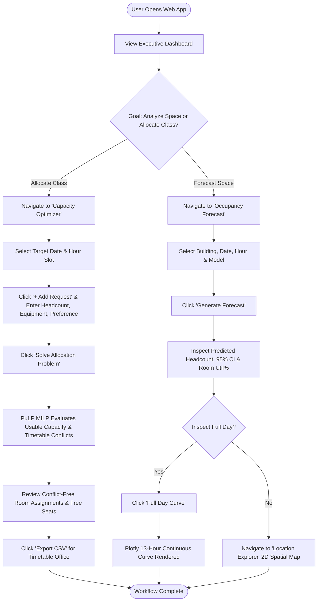
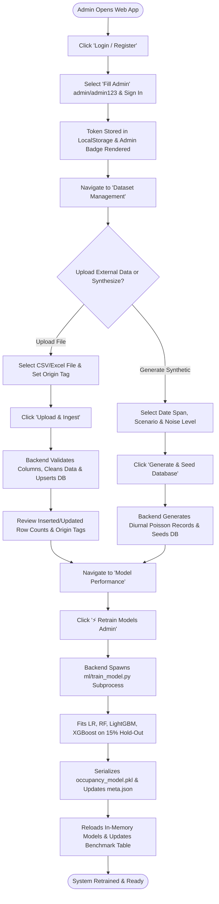

# UI/UX Design Specification

**Project Name:** Smart Campus Occupancy Forecasting with Spatiotemporal Analytics & Capacity Optimization  
**Interface Type:** Single Page Application (SPA) Web Dashboard  
**Document Version:** 1.0.0  
**Implementation Source:** `frontend/index.html`, `frontend/static/css/app.css`, `frontend/static/js/app.js`  
**Status:** Code-Verified / Implemented  

---

## 1. Design Goals & Principles

The user interface of **CampusPulse** is constructed to deliver an executive-level, data-dense, yet visually uncluttered experience for institutional decision-makers.

### 1.1 Core Principles
- **Zero-Latency Responsiveness:** Built using lightweight Vanilla JavaScript without heavy client frameworks; views switch instantaneously without full-page reloads.
- **Immediate Visual Scannability:** Crucial capacity metrics, stress levels, and overcapacity warnings are surfaced using consistent semantic color signifiers (Green, Amber, Red).
- **Interactive Spatiotemporal Exploration:** Complex multidimensional data (Day of Week vs. Hour, Building vs. Time, 2D coordinates) is rendered into interactive Plotly heatmaps and dynamic canvas plots.
- **Strict Data Provenance Transparency:** Every dataset view and chart visually distinguishes between synthetic demonstration data, user-uploaded attendance logs, and simulated sensor feeds.
- **Actionable Utility:** Every analytical table provides 1-click CSV export capabilities for institutional reporting.

---

## 2. Design System & Style Guide

The visual design system is defined through CSS custom properties in `frontend/static/css/app.css`.

### 2.1 Color Palette
```
┌─────────────────────────────────────────────────────────────────────────────┐
│                           COLOR SYSTEM TOKENS                               │
├───────────────────────┬───────────┬─────────────────────────────────────────┤
│ Token Variable        │ Hex Value │ Semantic Usage                          │
├───────────────────────┼───────────┼─────────────────────────────────────────┤
│ `--primary`           │ `#4f8cff` │ Primary brand color, buttons, active tab│
│ `--primary-hover`     │ `#3b72db` │ Hover state for primary buttons         │
│ `--bg`                │ `#f8fafc` │ Application canvas background (slate-50)│
│ `--card-bg`           │ `#ffffff` │ Container and card surface background   │
│ `--text`              │ `#1f2a37` │ Primary typography color (gray-800)     │
│ `--muted`             │ `#64748b` │ Secondary typography, labels, subtitles │
│ `--border`            │ `#e2e8f0` │ Card outlines, table cell borders       │
│ `--green`             │ `#10b981` │ Low stress ($<50\%$), success states    │
│ `--amber`             │ `#f59e0b` │ Medium stress ($50\%–79\%$), warnings   │
│ `--red`               │ `#ef4444` │ High stress ($\ge 80\%$), overcapacity  │
└───────────────────────┴───────────┴─────────────────────────────────────────┘
```

### 2.2 Data Provenance Badges
To guarantee transparency regarding the origin of data records, the UI applies standardized badge styling:
- **`badge.synthetic`:** Background `#f1f5f9`, border `#cbd5e1`, text `#475569` (Structured demonstration data).
- **`badge.imported`:** Background `#eff6ff`, border `#93c5fd`, text `#1d4ed8` (User-uploaded CSV/Excel attendance files).
- **`badge.measured`:** Background `#ecfdf5`, border `#a7f3d0`, text `#047857` (Direct IoT / turnstile sensor feed).

### 2.3 Typography & Sizing
- **Font Family:** `system-ui, -apple-system, BlinkMacSystemFont, "Segoe UI", Roboto, Helvetica, Arial, sans-serif`
- **Headings:**
  - `h1`: 1.25rem (20px), bold, tracking tight (Brand title)
  - `h2`: 1.20rem (19px), semi-bold (Top bar page title)
  - `h3`: 1.05rem (17px), semi-bold (Card titles)
  - `h4`: 0.95rem (15px), medium (Section subtitles)
- **Body & Controls:** 0.875rem (14px), font-weight 400.
- **Labels & Hints:** 0.75rem (12px), text-transform uppercase on table headers, color `--muted`.

### 2.4 Component Library
- **Card Containers (`.card`):** White background, border `1px solid var(--border)`, border-radius `8px`, subtle shadow `0 1px 3px rgba(0,0,0,0.05)`, padding `16px 20px`.
- **KPI Widgets (`.kpi`):** Micro-containers featuring an uppercase label (`.label`), large display value (`.value`, 24px bold), and contextual subtitle (`.sub`, 12px muted).
- **Buttons (`.btn`):** Height 36px, radius 6px, padding `0 14px`, transition `background 0.15s ease`.
  - `.btn.primary`: Blue background (`#4f8cff`), white text.
  - `.btn.ghost`: White background, border `1px solid var(--border)`, text `#1f2a37`.
  - `.btn-sm`: Compact height 28px, padding `0 10px`, font size 12px.
- **Tables (`table`):** Edge-to-edge cell borders, zebra hover rows (`tr:hover { background: #f8fafc; }`), header cells in slate muted style. Wrapped in `.table-responsive` for horizontal scrolling on mobile.
- **Modal Dialog (`.modal`):** Fixed full-screen overlay with dark backdrop blur (`rgba(0, 0, 0, 0.4)`), centered modal card (400px width), tabbed header for Login / Register.

---

## 3. Navigation Structure & Sitemap

The platform utilizes a persistent left sidebar on desktop viewports and a unified top bar.

```
CampusPulse Application Shell
│
├── Top Bar Header
│   ├── Dynamic View Title (Updates per active navigation view)
│   ├── User Role Badge (Guest / Demo Mode | User: username | Admin)
│   └── Authentication Action Button (Login / Register | Logout)
│
├── Persistent Disclaimer Banner (Data pipeline origin transparency notification)
│
└── Sidebar Navigation (10 Distinct Interactive Views)
    ├── 1. 📊 Dashboard               (#view-dashboard)
    ├── 2. 🗺️ Location Explorer        (#view-explorer)
    ├── 3. 📈 Occupancy Forecast      (#view-forecast)
    ├── 4. 🧬 Spatiotemporal Analytics (#view-analytics)
    ├── 5. ⚖️ Capacity Analysis        (#view-capacity)
    ├── 6. 🧩 Capacity Optimizer      (#view-optimizer)
    ├── 7. 📜 History & Logs          (#view-history)
    ├── 8. 📁 Dataset Management      (#view-dataset)
    ├── 9. 🏆 Model Performance       (#view-models)
    └── 10. ⚙️ Admin Console          (#view-admin)
```

---

## 4. Page-by-Page View Specification

### 4.1 View 1: Dashboard (`#view-dashboard`)
- **Purpose:** Executive overview of campus-wide occupancy, high-level KPIs, spatial stress points, and available free rooms.
- **Access Level:** Public / All Roles.
- **UI Components:**
  1. **KPI Metric Row (7 Cards):** Recorded Occupancy, Predicted Occupancy, Total Capacity, Utilization %, Overcapacity Alerts, Free Rooms count, Peak Forecast Hour.
  2. **Campus Buildings Utilization Bar Chart:** Custom HTML5 Canvas horizontal bar chart (`#buildBar`) rendering percentage utilization per building with dynamic color-coding.
  3. **Actual vs. Predicted Campus Trend Line:** Interactive Plotly scatter line chart (`#plotlyTrend`) comparing recorded actuals against ML forecasts across 08:00 to 20:00.
  4. **Available Rooms Table (`#freeRooms`):** Lists all rooms with $\ge 15$ free seats, room type, capacity, forecast count, and free seat tag. Includes **Export CSV** action.
  5. **Overcapacity Alerts Panel (`#overcap`):** Renders high-visibility amber/red alert blocks for any building exceeding the 80% stress threshold.
- **Empty / Error States:** If the database contains no records, renders an alert banner directing the administrator to run the database seeder.

### 4.2 View 2: Location Explorer (`#view-explorer`)
- **Purpose:** 2D interactive spatial visualization of the campus layout.
- **Access Level:** Public / All Roles.
- **UI Components:**
  1. **Filter Controls:** Date picker (`#mapDate`) and Operating Hour dropdown (`#mapHour`, 08:00–20:00).
  2. **Campus Map Canvas Container (`#campusMapContainer`):** A $100\% \times 450\text{px}$ canvas box rendering building nodes at exact $(x, y)$ coordinate percentages.
  3. **Interactive Building Nodes:** Nodes display building code, utilization %, and status tag. Clicking any node opens the detail drawer.
  4. **Building Detail Drawer (`#buildingDetailDrawer`):** Slide-out panel displaying building summary KPIs (Total Capacity, Current Occupancy, Utilization) and floor-by-floor room inventory table.

### 4.3 View 3: Occupancy Forecast (`#view-forecast`)
- **Purpose:** Point-in-time and continuous 13-hour day occupancy forecasting.
- **Access Level:** Public / All Roles.
- **UI Components:**
  1. **Control Toolbar:** Building dropdown (`#fcBuilding`), Date selector (`#fcDate`), Hour slider (`#fcHour`, range 8–20 with live hour display), and Algorithm selector (`#fcModel`: XGBoost, LightGBM, Random Forest, Linear Regression, LSTM).
  2. **Action Buttons:** "Generate Forecast" (point-in-time) and "Full Day Curve" (continuous day projection).
  3. **Forecast Result Card (`#fcResult`):** Displays predicted headcount, 95% confidence interval ($\pm \text{margin of error}$), capacity, utilization %, weather context, and room-by-room breakdown table.
  4. **Interactive Hourly Forecast Curve (`#fcPlotlyCard`):** Plotly continuous projection curve across hours 08:00–20:00 with shaded area fill.

### 4.4 View 4: Spatiotemporal Analytics (`#view-analytics`)
- **Purpose:** Deep spatiotemporal density analysis and model consistency tracking.
- **Access Level:** Public / All Roles.
- **UI Components:**
  1. **Filter Toolbar:** Building selector (All Buildings or specific block) and Date picker.
  2. **Day-of-Week vs. Hour Heatmap (`#heatmapDOW`):** Plotly 7x13 matrix (Monday–Sunday vs. 08:00–20:00) using the Viridis color scale.
  3. **Building vs. Time Utilization Heatmap (`#heatmapBuilding`):** Plotly spatial intensity matrix across all buildings and operating hours using the Plasma color scale.
  4. **Historical vs. Predicted Tracking Line Chart (`#histVsPredChart`):** 14-day daily tracking comparing actual recorded person-hours against model predictions.

### 4.5 View 5: Capacity Analysis (`#view-capacity`)
- **Purpose:** Granular room-by-room utilization auditing and space ranking.
- **Access Level:** Public / All Roles.
- **UI Components:**
  1. **Filter Controls:** Building filter dropdown, Date picker, "Analyze Capacity" button, and "Export CSV" button.
  2. **Room Stress Ranking Table (`#capTable`):** Sortable table detailing Room Code, Building, Room Type, Floor Level, Seated Capacity, Average Occupancy, Peak Occupancy, Utilization %, and Status badge (`Overcapacity`, `High`, `Medium`, `Low`).

### 4.6 View 6: Capacity Optimizer (`#view-optimizer`)
- **Purpose:** Multi-request class and event room allocation engine powered by PuLP MILP.
- **Access Level:** Public / All Roles (saving to user account requires authentication).
- **UI Components:**
  1. **Target Slot Controls:** Target Date and Target Hour (all 24 hours selectable; off-hours 21:00–07:00 labeled as closed).
  2. **Request Definition Table (`#reqTable`):** Interactive editable table with dynamic row additions.
     - Inputs per row: Course/Event name (dropdown from existing timetable or custom text), Student Count (number), Equipment Checklist (multi-select: computers, projector, whiteboard, sound system, lab equipment), Preferred Building.
     - Actions: "+ Add Request" button and row deletion ("&times;") buttons.
  3. **Allocation Solver Output (`#optResult`):**
     - Summary KPI row: Accommodated requests, New assignments, Moved classes, Unmet requests, and CBC solve time.
     - Detailed assignment table: Course, Headcount, Assigned Room, Building, Status (`new`, `kept`, `moved`, `no feasible room`), Seated Capacity, Free Seats remaining, Equipment satisfaction check, and algorithmic rationale.

### 4.7 View 7: History & Logs (`#view-history`)
- **Purpose:** Audit trail of past capacity optimization recommendations and prediction logs.
- **Access Level:** Public / All Roles.
- **UI Components:**
  1. **Recent Recommendations Table (`#recListTable`):** Details Run ID, Date, Hour Slot, Total Requests, Accommodated count, Moved count, Unmet count, and Timestamp. Includes CSV export.
  2. **Prediction Logs Table (`#predListTable`):** Details Log ID, Date, Hour, Target Building, Predicted Occupancy, Model Architecture, and Generation Timestamp. Includes CSV export.

### 4.8 View 8: Dataset Management (`#view-dataset`)
- **Purpose:** Data pipeline administration, file upload, synthetic data synthesis, and IoT stream simulation.
- **Access Level:** Public for simulation/preview; Admin recommended for upload/seeding.
- **UI Components:**
  1. **Storage Summary Box (`#datasetSummaryBox`):** KPI cards detailing total records in database, partitioned by origin: Synthetic Data, Imported Logs, and Measured Feeds.
  2. **Download CSV Template:** Direct link (`/api/dataset/template`) streaming standardized format.
  3. **Upload Real-World Data Form (`#uploadForm`):** File input (`.csv`, `.xlsx`, `.xls`), Origin Tag selector (`imported`, `measured`, `synthetic`), duplicate replacement checkbox, and upload submission button with live status feedback.
  4. **Synthetic Campus Dataset Generator:** Date range pickers, scenario dropdown (`normal`, `exam`, `fest`, `vacation`), noise level selector (5%, 8%, 15%), "Generate & Seed Database" button, and "Download Synthetic CSV" button.
  5. **Live IoT Sensor Simulation Box:** Room selector, observed headcount input, and "Transmit Stream Packet" button.
  6. **Database Records Preview Table (`#previewTable`):** Live 50-row paginated view of raw records with origin tags and CSV export.

### 4.9 View 9: Model Performance (`#view-models`)
- **Purpose:** Algorithmic transparency, hold-out benchmark verification, and administrator retraining.
- **Access Level:** Public benchmark viewing; Administrator access required for retraining.
- **UI Components:**
  1. **Model Benchmark Table (`#modelCompareTable`):** Renders comparative performance metrics across Linear Regression, Random Forest, LightGBM, and XGBoost:
     - Columns: Algorithm, MAE (Mean Absolute Error), RMSE, MAPE %, $R^2$ Accuracy Score, Training Time, Deployment Status.
  2. **Retrain Models Button (`#btnRetrain`):** Triggers `POST /api/model/retrain`. If unauthenticated or non-admin, prompts user with authentication modal.
  3. **Retraining Status Feedback (`#retrainStatus`):** Spinner and real-time execution log messages.

### 4.10 View 10: Admin Console (`#view-admin`)
- **Purpose:** System health verification and privileged operational management.
- **Access Level:** Public summary; credential information for demonstration testing.
- **UI Components:**
  1. **System Health & Server Metrics (`#adminSummary`):** Cards displaying API engine status (FastAPI 0.116 Online), active loaded ML forecaster, total database records, and campus room inventory count.
  2. **Role & Privilege Guidelines:** Clearly documents demo accounts (`admin/admin123`, `user/user123`).
  3. **System Endpoint Health Table (`#adminHealthBox`):** Direct links to Swagger UI (`/docs`), Health Check (`/api/health`), Dataset Summary, and Model Comparison APIs.

---

## 5. User Workflows (Mermaid Diagrams)

### 5.1 Standard User Forecasting & Space Optimization Flow



### 5.2 Administrator Data Ingestion & Model Retraining Flow



---

## 6. Responsive Viewport Adaptations

| Viewport Category | Screen Width Range | UI Layout Adjustments |
| :--- | :--- | :--- |
| **Desktop / Widescreen** | $\ge 1024\text{px}$ | Persistent 240px sidebar; 2-column card grids (`.grid2`); full-width interactive Plotly heatmaps and 2D spatial canvas. |
| **Tablet / Small Laptop** | $768\text{px} - 1023\text{px}$ | Sidebar remains visible with compressed padding; `.grid2` collapses to single-column stacking; horizontal scroll on tables. |
| **Mobile / Handheld** | $< 768\text{px}$ | Sidebar stacks vertically above main content; navigation buttons flow in flex wrap; KPI row scrolls horizontally; tables wrapped in `.table-responsive` with swipe scrolling. |

---

## 7. Accessibility (a11y) & Known Limitations

### 7.1 Accessibility Compliance Implemented
- **High-Contrast Semantic Labels:** Color indicators are never used in isolation; every utilization indicator pairs color with explicit text (`<50% Low`, `50-79% Medium`, `≥80% High`, `Overcrowded`).
- **Semantic HTML Structure:** Proper hierarchy using single top-level `<h1>`, sectional `<h3>`, standard `<form>`, `<label>`, `<input>`, `<select>`, and `<table>` elements.
- **Form Association:** All input elements feature explicit parent `<label>` bindings or unique `id` attributes.
- **Focus Indicators:** Interactive buttons and form inputs utilize clear outline rings on `:focus-visible`.

### 7.2 Known UI/UX Limitations
1. **Canvas Screen Reader Descriptions:** The custom HTML5 canvas building bar chart (`#buildBar`) does not provide an automated SVG fallback for screen readers (mitigated by the presence of identical numerical data in the adjacent table).
2. **Offline Mode Dependency:** Dynamic heatmaps rely on Plotly CDN (`https://cdn.plot.ly/plotly-2.35.2.min.js`); offline environments without internet access require bundling the Plotly JS script locally into `frontend/static/js/vendor/`.
